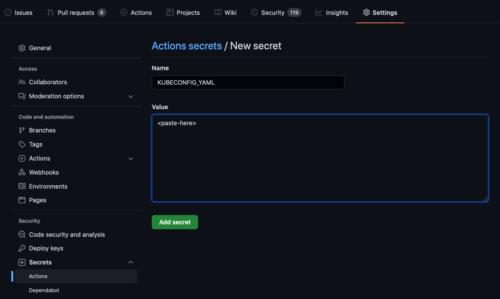

Reference CI/CD Template
===

> DISCLAIMER: This is a template repository implementation of a **sample** CI/CD pipeline. This repository should not be considered production worthy, it should be used to demo and learn how to use Ping Identity Containerized Software in a GitOps Model.

Welcome, Developer! 

This document is formatted as such:

- Start by launching an environment
- Understand what is running
- Complete a simple feature flow
- Consider what customization is available


**Table of Contents**
- [Reference CI/CD Template](#reference-cicd-template)
  - [General Information](#general-information)
  - [Prerequisites](#prerequisites)
  - [Launch an Environment](#launch-an-environment)
    - [KUBECONFIG_YAML](#kubeconfig_yaml)
    - [DevOps User and Key](#devops-user-and-key)
  - [Prepare Profiles](#prepare-profiles)
    - [Use Ping Identity's Baseline Server Profiles](#use-ping-identitys-baseline-server-profiles)
    - [Bring Your Own Profiles](#bring-your-own-profiles)
  - [Adjust Default Deployment](#adjust-default-deployment)
    - [Ingress](#ingress)
    - [Products](#products)
  - [Push to Prod](#push-to-prod)

## General Information

**Development Model** - Interaction follows a development model similar to [Github Flow](https://docs.github.com/en/get-started/quickstart/github-flow) or trunk-based. 

**Deployment architecture** - A Single Region implementation based on guidelines in [devops.pingidentity.com](devops.pingidentity.com).

**Default Branch** - prod

**Variables**

Files in `helm` and `manifest` have the .subst prefix. This allows the files to hold shell variables `${FOO}`. These variables will be computed to hardcoded values before deploying. Any variable on a .subst file should have a default set in `scripts/lib.sh`

**Reading Comments** - Comments are structured like Markdown headers. Multi-line comments are indented. For Readability, comments are not repeated with repeated code. On YAML, comment indentation matches relevant code

```shell
# Top Level Comment
## Sub-Comment ...
##   ... rest of Sub-Comment
### Sub-Sub-Comment
```

**Gitignore**
non .subst file counterparts are tracked in .gitignore to prevent accidental commits from local testing

## Prerequisites

Required:

- Set up template repo
  - click "Use This Template" to add it as a repository on your account.
  - git clone the new repo to `~/projects/devops/pingidentity-devops-reference-pipeline`
  > IMPORTANT: The folder name and is hardcoded in following commands.
- Publicly Accessible Kubernetes Cluster - the cluster must be _publicly accessible_ to use free [Github Actions Hosted Runners](https://docs.github.com/en/actions/using-github-hosted-runners/about-github-hosted-runners#about-github-hosted-runners). If you cannot use a publicly accessible cluster, look into [Self-hosted Runners](https://docs.github.com/en/actions/hosting-your-own-runners/about-self-hosted-runners)
- [kubectl](https://kubernetes.io/docs/tasks/tools/)
- [git](https://git-scm.com/book/en/v2/Getting-Started-Installing-Git)
- Understanding of [Helm](https://helm.sh/docs/intro/quickstart/) and consuming Helm Charts

## Launch an Environment

Start by getting a simple environment running. 

### KUBECONFIG_YAML

The Github Actions Runner will run commands on your kubernetes cluster. To provide the runner access to your cluster, store a base64 encoded YAML [kubeconfig file](https://github.com/zecke/Kubernetes/blob/master/docs/user-guide/kubeconfig-file.md) as a Github Secret.

A simple way to access the cluster is via a [service account](https://kubernetes.io/docs/reference/access-authn-authz/service-accounts-admin/).

> This pipeline will run entirely in one namespace, define the namespace in your local shell environment

```
export K8S_NAMESPACE=<ping-devops-user>
```

```
cat <<EOF | kubectl apply -f -
apiVersion: v1
kind: ServiceAccount
metadata:
  name: ping-devops-admin
  namespace: ${K8S_NAMESPACE}
---
apiVersion: v1
items:
- apiVersion: rbac.authorization.k8s.io/v1
  kind: Role
  metadata:
    name: namespace-admin
    namespace: ${K8S_NAMESPACE}
  rules:
  - apiGroups:
    - '*'
    resources:
    - '*'
    verbs:
    - '*'
kind: List
metadata:
  resourceVersion: ""
  selfLink: ""
---
apiVersion: rbac.authorization.k8s.io/v1
kind: RoleBinding
metadata:
  name: namespace-admin
roleRef:
  kind: Role
  name: namespace-admin
  apiGroup: rbac.authorization.k8s.io
subjects:
- kind: ServiceAccount
  name: ping-devops-admin
EOF
```

```
export USER_TOKEN_NAME=$(kubectl -n ${K8S_NAMESPACE} get serviceaccount ping-devops-admin -o=jsonpath='{.secrets[0].name}')
export USER_TOKEN_VALUE=$(kubectl -n ${K8S_NAMESPACE} get secret/${USER_TOKEN_NAME} -o=go-template='{{.data.token}}' | base64 --decode)
export CURRENT_CONTEXT=$(kubectl config current-context)
export CURRENT_CLUSTER=$(kubectl config view --raw -o=go-template='{{range .contexts}}{{if eq .name "'''${CURRENT_CONTEXT}'''"}}{{ index .context "cluster" }}{{end}}{{end}}')
export CLUSTER_CA=$(kubectl config view --raw -o=go-template='{{range .clusters}}{{if eq .name "'''${CURRENT_CLUSTER}'''"}}"{{with index .cluster "certificate-authority-data" }}{{.}}{{end}}"{{ end }}{{ end }}')
export CLUSTER_SERVER=$(kubectl config view --raw -o=go-template='{{range .clusters}}{{if eq .name "'''${CURRENT_CLUSTER}'''"}}{{ .cluster.server }}{{end}}{{ end }}')
```

```
cat << EOF > ${HOME}/.kube/ping-devops-admin-config
apiVersion: v1
kind: Config
current-context: ${CURRENT_CONTEXT}
contexts:
- name: ${CURRENT_CONTEXT}
  context:
    cluster: ${CURRENT_CONTEXT}
    user: ping-devops-admin
    namespace: ${K8S_NAMESPACE}
clusters:
- name: ${CURRENT_CONTEXT}
  cluster:
    certificate-authority-data: ${CLUSTER_CA}
    server: ${CLUSTER_SERVER}
users:
- name: ping-devops-admin
  user:
    token: ${USER_TOKEN_VALUE}
EOF
```

To trigger deployments locally as well as from GitHub Actions, set this file as your kubeconfig:

```
export KUBECONFIG="${HOME}/.kube/ping-devops-admin-config"
```

Base64 encode the contents of this file and create a [GitHub Actions Secret](https://docs.github.com/en/actions/security-guides/encrypted-secrets):

```
cat ${HOME}/.kube/ping-devops-admin-config | base64 | pbcopy
```

> Note, `pbcopy` on Mac copies stdin for the command to the clipboard



### DevOps User and Key

Create a GitHub Actions Secrets for your Ping Identity DevOps User and Key.
If the PING_IDENTITY_DEVOPS_USER and PING_IDENTITY_DEVOPS_KEY variables are sourced in your environment:

```
echo "${PING_IDENTITY_DEVOPS_USER}" | base64 | pbcopy
```
Create a secret named PING_IDENTITY_DEVOPS_USER_BASE64 with the value. 

## Prepare Profiles

Server Profiles are used to deploy configuration to products. The pipeline uses the profiles directory for storing config.

### Use Ping Identity's Baseline Server Profiles
<!-- TODO CLEAN THIS UP-->
[Ping Identity's Baseline Server Profiles](https://github.com/pingidentity/pingidentity-server-profiles/tree/master/baseline) are maintained for demo and testing purposes. Eventually you will want to [bring your own profiles](#bring-your-own-profiles)

To test this environment quickly use the [baseline server-profile](https://github.com/pingidentity/pingidentity-server-profiles/tree/master/baseline).


### Bring Your Own Profiles

<!-- TODO -->


## Adjust Default Deployment

The default deployment will deploy a number of software products with simple configurations and [ingresses](https://kubernetes.io/docs/concepts/services-networking/ingress/). Ingresses rely on the kubernetes cluster having an [ingress controller](https://kubernetes.io/docs/concepts/services-networking/ingress-controllers/) deployed. 

### Ingress

The default setup on [values.yaml.subst] will work for an nginx ingress controller with class "nginx-public". Update `global.ingress` on values.yaml to match your environment.

### Products

If you want to remove any products, change `<product>.enabled` to false. Over time, as you become more comfortable with the repo you can remove those pieces. 

Example for turning off pingdataconsole:

```
pingdataconsole:
  enabled: false
  envs:
    SERVER_PROFILE_PATH: profiles/pingdataconsole
    PDC_PROFILE_SHA: "${PINGDATACONSOLE_SHA}"
```


**Create a branch** off the default branch. This deploys an up-to-date, isolated environment to build a new feature. 

**Follow ingress URLs** - once the environment has deployed. Features are developed through admin UIs, command line utilities, or api calls. Ingress URLs can be found with: 
kubectl get ingress -n <namespace>

**Thoroughly test** your new feature in your local environment. 

**Run generate-profile script** Once ready to bring code back for a commit and pull request. The generate-profile script uses your local git branch to identify which environment to build a profile from.

## Push to Prod

Merge to master as frequently as needed, when ready to push a change, tag the branch. Pushing tags leaves an easy to trace history and room for rollbacks. 